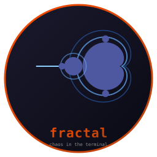
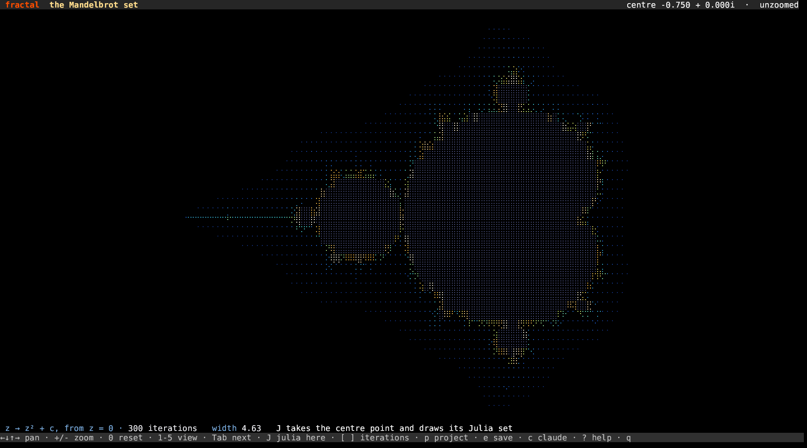
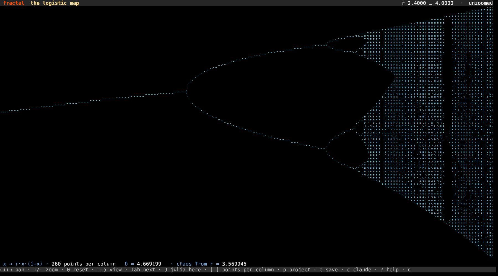
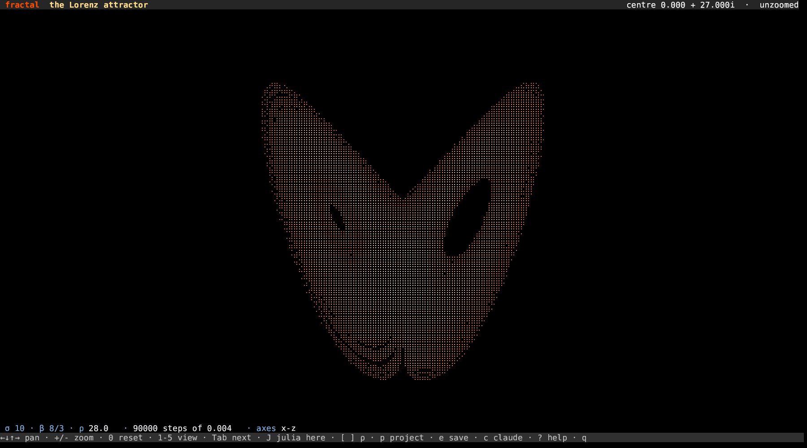

# fractal



**Chaos in your terminal. Written in Rust.**

     [](https://github.com/isene/fe2o3)

Five pictures of one idea: repeat something simple, and watch what it
settles into. The Mandelbrot set, the Julia set of whatever point you are
standing on, the logistic map's road into chaos, and the Lorenz and Hénon
attractors. Drawn in braille, computed when you press a key and never in
between.



## Features

- **The Mandelbrot set**, with the cardioid and the big bulb tested
  outright so the shallow view stays instant, and the iteration cap
  climbing with the zoom
- **Julia sets**: press `J` and the point you are standing on becomes the
  c of its own Julia set. Press it again and you are back where you were,
  on the Mandelbrot set
- **The logistic map**, x → r·x·(1−x), plotted against r. Feigenbaum's
  δ = 4.669199 and the r = 3.569946 where the doubling gives way to chaos
  are worked out while the app runs, not looked up
- **The Lorenz attractor**, integrated with fourth-order Runge-Kutta, with
  ρ on a knob: turn it below 24.74 and the butterfly collapses onto a
  single point
- **The Hénon map**, 300,000 points folded onto a fractal you can zoom into
- **Pan and zoom** everywhere, with the arrows and `+` / `-`
- **Save** (`e`) the picture as braille text, and **ask Claude** (`c`)
  about what is on screen
- **Idle-free**: nothing animates, nothing polls. A frame is computed when
  you ask for one



## How it draws

A braille cell is 2×4 dots and one colour, which is a choice: the dots
carry eight times the detail, the colour only one value per cell. So the
escape-time pictures dither. A dot lights when its own value clears an
ordered threshold, so the density of lit dots inside a cell tracks the
field and the colour is that cell's average. Fine structure lands in the
dots, the broad shape in the colour.

The attractors do the opposite: every sub-pixel the trajectory touched
lights up, because dithering would throw away the lonely points that
carry the shape, and the colour carries how often it came back.



## Install

```bash
curl -L "https://github.com/isene/fractal/releases/latest/download/fractal-linux-x86_64" \
  -o ~/bin/fractal && chmod +x ~/bin/fractal
```

Or build it: `cargo build --release`. It needs
[crust](https://github.com/isene/crust) checked out beside it.

## Key bindings

| Key | Action |
|-----|--------|
| ← ↓ ↑ →, h j k l | Pan |
| + -, i o | Zoom in and out |
| 0 | Back to where this view started |
| 1-5 | Mandelbrot · Julia · logistic · Lorenz · Hénon |
| Tab | The next view |
| J | From this point to its Julia set, and back |
| [ ] | This view's knob: iterations, points per column, ρ, or a |
| p | Which two Lorenz axes to look at |
| e | Save the picture as braille text in `~/fractal.txt` |
| c | Ask Claude about what is on screen |
| r | Redraw from scratch |
| ? | Help |
| q | Quit |

## CLI

```bash
fractal            # opens on the Mandelbrot set
fractal lorenz     # or julia, logistic, henon
fractal --help
```

## Part of the Rust Terminal Suite (Fe₂O₃)

See the [Fe₂O₃ suite overview](https://github.com/isene/fe2o3) and the
[landing page](https://isene.org/fe2o3/). It sits next to
[particles](https://github.com/isene/particles) (the Standard Model),
[isotopes](https://github.com/isene/isotopes) (the chart of the nuclides)
and [stars](https://github.com/isene/stars) (the HR diagram).

## License

Public domain (Unlicense). Take it, fork it, or ignore it.

— [Geir Isene](https://isene.com)
